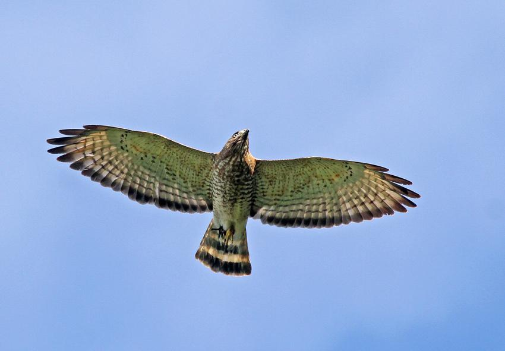

{width=850px}
\
\

Cabrera-Hernández, R., I. N. Chacón-Salas, E. J. Chávez-Calderón, S. Escobar-Lasso, M. Gil-Fernández, H. González-Ancín, S. Guerrero-Ortiz, H. A. Herrera-Vargas, M. Leija-Montoya, L. M. Restrepo-Monsalve, y E. D. Tenez-Rivas. 2015. Biodiversidad, situación costera, conectividad e interacciones humano-fauna en el Parque Nacional Cahuita. G. Wong y J. Sáenz (eds.). Informe técnico. Instituto Internacional en Conservación y Manejo de Vida Silvestre (ICOMVIS), Heredia, Costa Rica. 129 pp.

Porras-Peñaranda, P., Robichaud, L., & Branch, F. (2004). New full-season count sites for raptor migration in Talamanca, Costa Rica. Ornitologia Neotropical, 15(Suppl), 267-278.

Ruelas Inzunza, E., Goodrich, L. J., & Hoffman, S. W. (2010). Cambios en las poblaciones de aves rapaces migratorias en Veracruz, México, 1995-2005. Acta zoológica mexicana, 26(3), 495-525.

