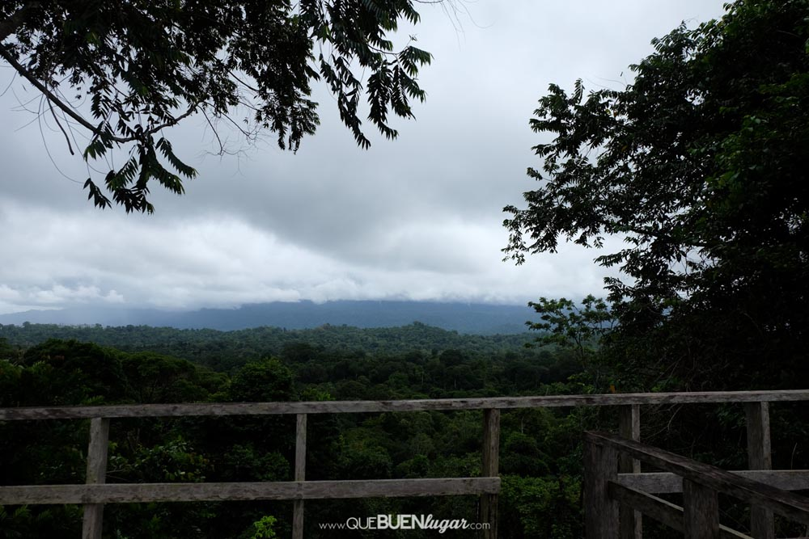
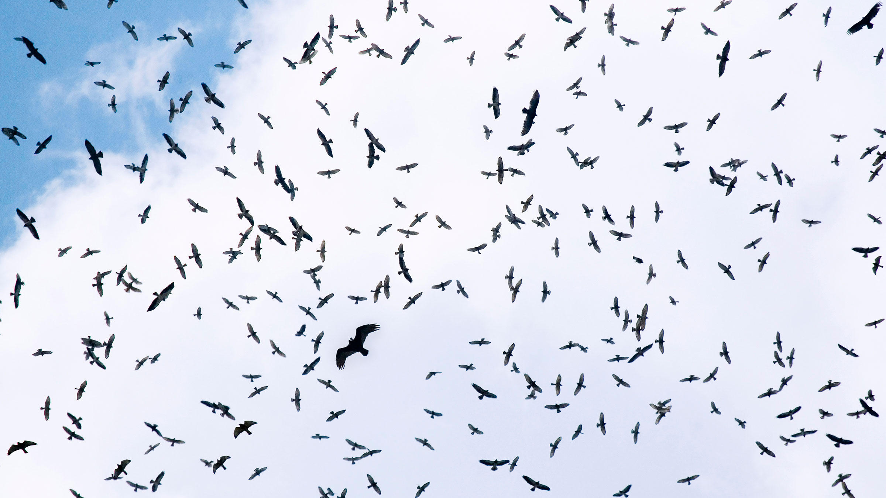

###**Importancia de Kèköldi, las estaciones de conteo y la aplicación de protocolos para la migración de aves**

\

{width=650px}

Imagen 1. Vista desde la torre de conteo en Kèköldi.
\
\

La reserva indígena Keköldi se localiza en el Corredor Biológico Talamanca-Caribe, este corredor se caracteriza por poseer una cobertura forestal del 82%, lo que indica que es un área poco fragmentada, con bosques continuos que conecta al Parque Nacional Cahuita con el Refugio de Vida Silvestre Gandoca-Manzanillo y con la Reserva Biológica Hitoy Cerere. Esta condición le da la oportunidad a Keköldi de ser un lugar estratégico para la observación de la migración de aves, que utilizan el espacio a los alrededores de la reserva para descansar; ya que la altura de sus montañas permite tener una vista panorámica de la actividad de la avifauna (Cabrera-Hernández et al., 2015).

\

La ubicación de Keköldi es privilegiada en el mundo, tanto así que se encuentra dentro de los tres primeros lugares de conteo en el mundo. Este punto geográfico tan importante para contar rapaces, se debe a la cercanía de las montañas a la costa (Figura 1), lo que ocasiona que se forme un corredor angosto (un embudo) por donde las aves tienen que pasar (Cabrera-Hernández et al., 2015). 

\

Sobre estos puntos de muestreo, pasan 17 especies de aves entre ellos se encuentran águilas pescadoras, gavilanes, zopilites y halcones (Figura 2). Cuando la migración está en la temporada más intensa, se han llegado a contabilizar entre 50 mil y 450 mil individuos por día. Sumado a este dato, durante una temporada completa se han contado hasta 10 millones de aves. Este dato lo vuelve un lugar primordial en el mundo para el monitoreo de rapaces (Porras-Peñaranda et al., 2004). 

\

Es por esta razón que aplicar protocolos de monitoreo de aves migratorias es de vital importancia para conocer el estatus de las poblaciones a lo largo del tiempo. Generando información en escalas regionales y continentales, siendo más importante en áreas en donde se sabe con certeza que la mayoría de la migración  pasa por un área determinada (Ruelas et al., 2010).

  
\

{width=650px}

Figura 2. Diversida de aves migratorias en una termal.
\
\

El siguiente gráfico muestra la proporción de la dinámica de la migración durante las 8 am hasta las 4 pm para los días de muestreo en la Reserva Indígena Kèköldi.*Elanoides forficatus* (STKI), *Buteo platypterus* (BWHA), *Buteo swainsoni* (SWHA), *Pandio haliaetus* (OSPR), *Falco peregrinus* (TUVU).

\

